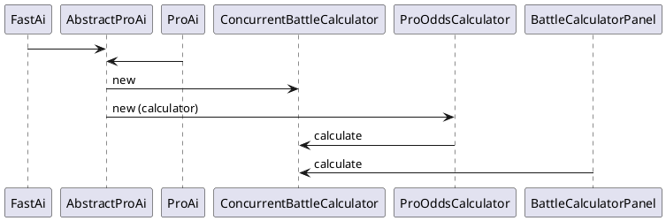

# Stochastic Battle Calculator

## Motivation

The current battle calculator is slow, memory intensive, and imprecise. It copies the whole game data and then
experimentally simulates individual battles. This way to calculate a probability distribution is called the _monte carlo
method_.

The intended _Stochastic Battle Calculator_ does not simulate individual battles, but works with probability
distributions.

## Target TripleA version

... is 2.7/3.0, so 2.6 can be completed, soon. How can I submit a PR for 2.7/3.0?

## Compromises

### Significance threshold

The fundamental complexity of the core algorithm is at least n to the power of 4, with n being the size of the armies.
In order to be fast for armies larger than 20 units, a threshold ends calculation on areas of the probability
distribution, as soon as the probability of the area falls under a defined "significance threshold", currently 1%.

## Current limitations

The current version of the StochasticBattleCalculator works for *land and water battles* and takes *infrastructure* into account,
including take over, destruction, or conversion of units. It supports units with *multiple hit points*  *bombardment*
and works with *unit support* under the most common circumstances, i.e. artillery supporting infantry.

Currently, it can handle 90% of the battles in `270BC Wars` and about three quarters of the battles in `Big World: 1942 v3 Rules`.
With manageable effort, it can be enhanced to handle 99,9% of the battles in `270BC Wars` 
and about 80% of the battles in `Big World: 1942 v3 Rules`. It can probably be enhanced to handle 99.9% of the battles 
in `Big World: 1942 v3 Rules`, but this it not yet certain.

### Units with *multiple hit points*

The battle calculator considers damaged units to be as go in the battle result as undamaged units.
(RaiNova believes, the legacy ConcurrentBattleCalculator does so, too.)

### Unit support

For correct calculation of battles with unit support, supporting units must be later in the *killing order* than the
units they support. This is true for WWII artillery supporting infantry.

It is not true e.g. for *Archers* in *A song of ice and fire* supporting *faceless men*. Battle results with supporting
units earlier in the killing order than the units they support are currently calculated incorrectly. It should be
possible to fix that within an acceptable amount of time.

### Dice

The current implementation supports games with dice with up to eight sides (e.g. six sided dice like in most games and
eight sided dice like in *Settlers: Age of Tribes*). Support with dice up to twelve sides is possible relatively easily,
but not yet implemented.

### AA guns / 270BC artillery

Support seems possible with quite some effort, but not implemented yet

### Terrain effects

Support of battles with terrain effects seems possible with very reasonable effort, but not implemented yet

### First strike

Support seems possible with limited effort, but not implemented yet

### Cannot target / can nor be targeted by (e.g. submarines)

Support may be possible with considerable effort. Not implemented yet

### Best time to retreat / submerge (canEvade)

Currently, the calculator assumes both parties engage until all fighting units of at least one party are killed.

## Fundamental concerns

The legacy battle calculator (ConcurrentBattleCalculator) wraps around essential game functionality to run a battle
(class BattleCalculator). It therefore inherits those essential game functionalities.

While the StochasticBattleCalculator reuses as much functionality as possible (e.g. calculating the *killing order*),
its design does not make it possible to reuse the BattleCalculator. As a consequence, every battle feature
(e.g. first strike, units that cannot target / cannot be targeted by other units) has to be
reimplemented. The implementation for the StochasticBattleCalculator can differ greatly for the implementation 
for the game core BattleCalculator. Aspects that can/could be added to the BattleCalculator in simple ways, can
be quite a challenge to the StochasticBattleCalculator. 

### Consequences
* StochasticBattleCalculator cannot handle all battles at the moment, and probably never can. 
For battles it can't handle, a fallback to the legacy ConcurrentBattleCalculator is implemented.
So StochasticBattleCalculator cannot completely replace ConcurrentBattleCalculator in the foreseeable future.
* Every enhancement in battle functionality will either have to be reimplemented in the StochasticBattleCalculator -
maybe with considerable effort - or the StochasticBattleCalculator will have to fall back to the legacy 
ConcurrentBattleCalculator for it.

## Programming language

In order to achieve the necessary development speed for me (RaiNova) to come as for sas I gut during the 2021/22 winter
break, I wrote new classes in Kotlin. Kotlin is very well supported by *IntelliJ* and integrates nicely with Java. The
only issues I encountered related to lombok, and I could find work arounds.

## Ideas not yet implemented

For speed it may combine states (e.g. 95-100 attacker units left / 85-90 defender units left)
and stops processing a particular state, when the probability of that state has fallen under a defined threshold.

The StochasticBattleCalculator caches probability distributions. The cache should be reduced if memory becomes scarce.

### Interactive Battle Calculator (BattleCalculatorDialog/BattleCalculatorPanel)

Load ConcurrentBC only if StochasticBattleCalculator can't calculate the battle

If StochasticBattleCalculator can handle the battle: 
* Show result immediatly (no button press).
* Also in the territory panel

## Functionality

### Core functionality

1. Detect whether the StochasticBattleCalculator can calculate the battle
   (and otherwise call the legacy ConcurrentBattleCalculator) 
2. Setup killing order
3. Setup probability distribution of hits caused per army size
4. Setup probability distribution by state
5. While probability of interim states > threshold
   - Calculate distribution of next round

### Big battle scalability

On 9th Jan 2022 the battle calculator seems to be able to handle battles with quite large armies 
(i.e. 40 units per party or more). However, it cannot handle a battle with more than 255 units of the same hit power 
in one party.

The current idea how to support games with 12 sided dice will reduce the number of units of the same hit power in one 
party to 63 for hit power 1-4 resp. 31 for hit power >= 5 (but only for games with dice with more than 8 sides;
for games with dice with <= 8 sides, the limit will still be 255).

## Integration

### Calling the Stochastic Battle Calculator

The `StochasticBattleCalculator` shall replace the `ConcurrentBattleCalculator`, which is mainly used in the way the
following call diagram shows:

The creation of a `ConcurrentBattleCalculator` in `AbstractProAi` resp. `BattleCalculatorPanel` will be replaced by a
creation of a `StochasticBattleCalculator`.

### Return value

`BattleCalculator` returns an `AggregateResults` instance, which contains a List of `BattleResults`
and provides the following summary results:

* average attacking/defending units remaining: Collection<Unit>
* average tuv of attacker/defender units left over
* average tuv swing: double
* average attacking/defending units left (when attacker/defender won): double
* percentage attacker win / draw / defender win: double
* average battle rounds fought: double
* roll count: int
* total calculation time: long

All results but the roll count also make sense for the `StochasticBattleCalculator`.

### Instrumentation

#### Instrumentation Panel

The instrumentation panel is intended for development use only and not intended to show up in a normal game.

#### Ideas not (yet) implemented

The `StochasticBattleCalculator` can write and read `BattleScenario`s
(in XML, to/from the auto save folder) and can report values like

* number of times called
* time consumed
* time saved (in comparison to `ConcurrentBattleCalculator`)
* game copies saved (in comparison to `ConcurrentBattleCalculator`)
* memory usage into a panel (sub panel of TripleAFrame).

The `StochasticBattleCalculator` can write

* probability distribution of hits caused per army size
* probability distribution by state
  (into CSV files to be read and displayed e.g. by Excel, to the auto save folder)

### Integration of `ConcurrentBattleCalculator`; incremental development

`StochasticBattleCalculator` calls `ConcurrentBattleCalculator`

1. for comparison of speed, memory consumption, results
2. to help out, if (the current version of) `StochasticBattleCalculator` can't handle the particular `BattleScenario` (
   yet)

This allows `StochasticBattleCalculator` to be developed incrementally. 

## Internal design considerations

The core loop of the main algorithm resides in `StochasticBattleCalculator.calculateForRemainingAttackers`.
It iterates over all possible battle states of the current round in order to determine the probability distribution 
of the battle states of the current round.

You would expect that it iterates from one current state to the next and distributes the probability 
of that current state among the future states that can be reached from the respective current state.
However, currently the algorithm iterates from one future state to the next and from there iterates
through the current states. This way the write operations switch location slowly while the read operations 
switch quickly. 

I was hoping that this would allow multithreading and avoid memory access collisions with write operations.
However, there is currently no multithreading in the core loop. That's because I couldn't identify any speedup.
I guess the reason is that the bottleneck is not within the CPU but between the CPU and RAM.

If anybody could help me to speed up the core loop by multithreading (or in any other way), I'd be happy.

If I don't achieve any further insights regarding this issue, I will probably invert the core loop, i.e.
go from one current state to the next rather than go from one future state to the next, because that will 
probably integrate better with extensions of that algorithm, e.g. for calculation of battles that include aa fire.
